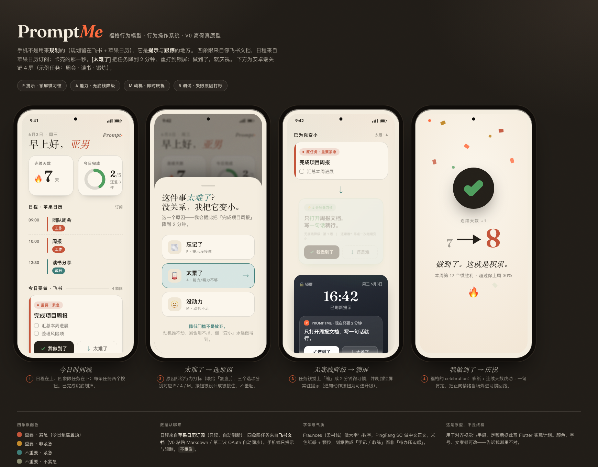

<div align="center">

# 🌱 PromptMe

**记录每一次行动，成为想成为的人。**
*Prompt Yourself Into Action.*

基于福格行为模型（Fogg Behavior Model · B=MAP）的**个人行为操作系统**——
不是又一个日历，而是把目标变成**持续行动**的随身教练。




</div>

---

## 📖 这是什么

普通日历记录**时间**；PromptMe 关心的是行为本身：

> **为什么没执行 · 怎样更容易执行 · 如何持续执行。**

它把你**已有的规划**（飞书四象限任务文档 + 苹果日历时间块）拉到手机上，在你**卡壳的那一秒**介入：提示你、帮你把任务变小、做到了就庆祝。手机端只负责**提示与跟踪**，绝不让你重新录入。

## 💡 核心理念：B = M · A · P

福格行为模型认为，行为发生 = **动机(Motivation) × 能力(Ability) × 提示(Prompt)**。PromptMe 把它落进每一个交互：

| 要素 | 在 PromptMe 中 |
| --- | --- |
| **P** 提示 | 定时通知 + 锁屏常驻「今日·重要紧急」 |
| **A** 能力 | 任务拆解；右滑 `太难了` 触发**无底线降级**到 2 分钟微习惯 |
| **M** 动机 | 左滑 `我做到了` 即时庆祝动画 + 连续天数 / 完成率 |
| **B** 调试 | AI 复盘未完成任务：定位 M/A/P 哪一项塌了，并给出修法 |

> **点睛交互 —— 卡住时不硬撑，而是变小：**
> 右滑 `太难了` → 选原因（忘记 / 太累 / 没动力，分别对应 P / A / M）→ AI 把任务「无底线降级」成一个 2 分钟、几乎不可能失败的微习惯，并刷到锁屏。降低门槛不是放弃，是福格法则。

## ✨ 功能

**✅ 已实现（V0 · 第一波 ①②③）**
- 🎯 **四象限今日时间线**：苹果日历事件 + 飞书任务，按艾森豪威尔四象限聚合，「重要紧急」置顶；顶部连续天数/完成率固定，已完成清单分页加载
- 🔁 **福格闭环（滑动交互）**：左滑 `我做到了`（彩纸庆祝 + 连续天数）· 右滑 `太难了`（选原因 → 无底线降级成 2 分钟微习惯，刷到锁屏）；已完成任务支持点按重开、右滑删除
- 📅 **苹果日历订阅**：粘贴 iCloud published / webcal 链接，只读拉取今日时间块，订阅变更实时刷新日程
- 🧩 **飞书任务导入**：粘贴四象限 Markdown 一键导入今日，绝不重录
- 🤖 **AI 教练（自带 key）**：一键「整理今日」优先级建议、傍晚「复盘未完成」定位 M/A/P；OpenAI 兼容协议，讯飞 MaaS / DeepSeek / Qwen 预设 + 测试连接
- 🔔 **本地通知** + 锁屏微习惯提示
- 📊 连续天数 / 今日完成率
- 🧩 纯函数核心（全 TDD）：飞书 Markdown 解析、ICS 解析、福格聚合、降级、AI 提示与容错解析
- 💾 本地优先存储（SQLite / Drift）

**🚧 规划中**
- [ ] 飞书文档 **OAuth 自动同步**（第二波，免手动粘贴）
- [ ] 跨端（macOS / Web）
- [ ] CalDAV 双向写回 · 锁屏 Widget

## 🛠️ 技术栈

| 层 | 选型 |
| --- | --- |
| 客户端 | **Flutter**（安卓优先，一套代码可扩展多端） |
| 状态管理 | **Riverpod** |
| 本地数据库 | **Drift**（类型安全的 SQLite） |
| AI | 自带 Key 直连，**OpenAI 兼容协议**（讯飞 MaaS / DeepSeek / Qwen 等），base URL 预设 + 测试连接 |
| 后端（第二波） | 轻量 Serverless（仅作飞书 OAuth token 代理） |
| 工程方法 | spec → 高保真原型 → **TDD 实现计划** → AI 辅助实现 |

## 📂 项目结构

```
prompt-me/
├── frontend/
│   └── promptme-app/        # Flutter App（安卓优先，第一波主体）
│       ├── lib/
│       │   ├── domain/      # 纯逻辑：解析器 / 福格计算 / 降级 / AI（全 TDD）
│       │   ├── data/        # Drift 表 + DAO
│       │   ├── state/       # Riverpod providers + controller
│       │   ├── features/    # 今日时间线 UI 等
│       │   └── theme/       # 暖调纸感主题
│       └── test/            # 单元 + widget 测试
├── backend/                 # 后端（第二波：飞书 token 代理 / serverless）
└── docs/
    ├── superpowers/         # 设计 spec · 高保真原型 · 实现计划
    ├── api-spec/ architecture/ db-design/ prd/ test/
    └── assets/
```

## 🚀 快速开始

**前置**：[Flutter SDK](https://docs.flutter.dev/get-started/install) 3.44+、Android Studio + SDK，一台安卓真机或模拟器（`flutter doctor` 安卓段无误）。

```bash
git clone https://github.com/ching7/prompt-me.git
cd prompt-me/frontend/promptme-app

flutter pub get
dart run build_runner build      # 生成 Drift 代码
flutter test                     # 跑测试（29 个用例）
flutter run                      # 跑到设备上
```

> 🇨🇳 **国内网络提示**：建议配置 pub 镜像 `PUB_HOSTED_URL=https://pub.flutter-io.cn`；`sqlite3` 原生库需从 GitHub 下载，首次构建请挂代理（`export https_proxy=...`），下载后会缓存。Gradle 阿里云/腾讯镜像已写进 `android/`。

## 🗺️ 路线图

- [x] **第一波 ①** 地基与核心逻辑（脚手架 · 纯函数 · Drift 数据层，全 TDD）
- [x] **第一波 ②** 今日时间线 + 福格闭环 UI
- [x] **第一波 ③** 集成：苹果日历订阅 · 飞书粘贴导入 · AI 整理/复盘 · 通知 · 设置
- [ ] **第二波** 飞书 OAuth 自动同步（轻量后端）
- [ ] **第三波** CalDAV 双向写回 · 屏幕使用时间 · 锁屏 Widget

## 📚 设计文档

- [设计 Spec](docs/superpowers/specs/2026-06-03-promptme-v0-design.md)
- [高保真原型（HTML）](docs/superpowers/prototypes/2026-06-03-promptme-v0-mockup.html)
- [第一波实现计划 ①](docs/superpowers/plans/2026-06-03-promptme-wave1-foundation.md) · [②](docs/superpowers/plans/2026-06-03-promptme-wave1-today-ui.md) · [③](docs/superpowers/plans/2026-06-03-promptme-wave1-integrations.md)

## 🙏 致谢

- **BJ Fogg** —— 福格行为模型（B=MAP）与《Tiny Habits》微习惯，本项目的理论根基。

## 📄 License

[MIT](LICENSE) © 2026 PromptMe

<div align="center"><sub>用提示驱动行动 · Prompt Yourself Into Action.</sub></div>
